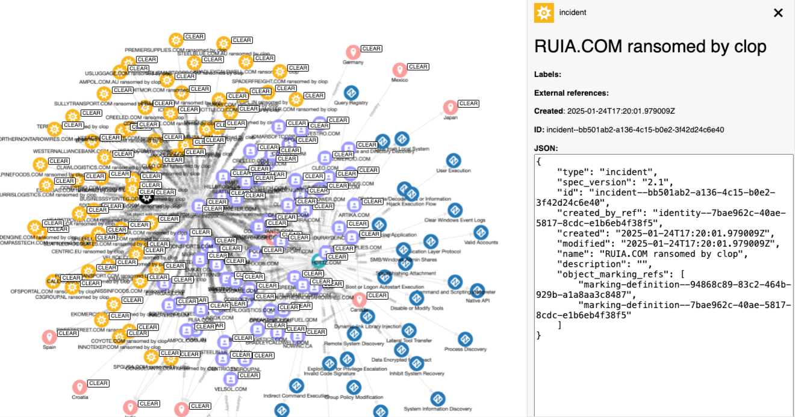

# ransomware2stix

## Overview



ransomware2stix turns ransomware intelligence on [ransomware.live](https://ransomware.live/) into STIX 2.1 objects ([consider supporting the project](https://buymeacoffee.com/ransomwarelive)).

We build this because our tooling is stuctured in STIX 2.1 and we wanted to add ransomware.live data for additional context on our research.

ransomware2stix supports:

* MITRE ATT&CK tagging of ransomware groups
* Tracking of crypto wallets linked to groups
* Linking tools to groups (including support for the [Ransomware Tool Matrix](https://github.com/BushidoUK/Ransomware-Tool-Matrix))
* Identification of ransomware victims with group attribution

## Install

```shell
# clone the latest code
git clone https://github.com/muchdogesec/ransomware2stix
# create a venv
cd ransomware2stix
python3 -m venv ransomware2stix-venv
source ransomware2stix-venv/bin/activate
# install requirements
pip3 install -r requirements.txt
```

### Environment Setup

You will need a ransomware.live API key. [Sign up here](https://www.ransomware.live/#/regsiter) to get one.

Create a `.env` file in the root directory:

```shell
RANSOMWARE_LIVE_API_KEY=YOUR_API_KEY_HERE
```

## Run

```shell
python3 -m ransomware2stix \
	--min_discovered YYYY-MM-DD \
	--max_discovered YYYY-MM-DD \
	--groups GROUP_NAME [GROUP_NAME ...]
```

Where:

* `--min_discovered` (optional, `YYYY-MM-DD`): Filter results to only include victims discovered after this date. Filters based on both attack date and discovery date. Default includes all historical data.
* `--max_discovered` (optional, `YYYY-MM-DD`): Filter results to only include victims discovered before this date (inclusive, set to 23:59:59.999999 of the specified day). Default includes all future data.
* `--groups` (optional): Filter output to only include specific ransomware group(s). Accepts one or more group names (space-separated). Group names are case-insensitive. Default processes all groups.

The script outputs JSON bundles to the `outputs/` directory:

```txt
├── outputs
│   └── bundles
│       ├── <GROUP_NAME_1>.json
│       ├── <GROUP_NAME_2>.json
│       └── ...
├── logs
│   └── ransomware2stix-YYYY-MM-DDTHH-MM-SS.txt
```

### Examples

Get data for all groups with victims discovered in January 2025:

```shell
python3 -m ransomware2stix \
	--min_discovered 2025-01-01 \
	--max_discovered 2025-01-31
```

Get all data for the clop group:

```shell
python3 -m ransomware2stix \
	--groups clop
```

Get data for multiple specific groups:

```shell
python3 -m ransomware2stix \
	--groups clop akira lockbit3
```

Note, to get all available group names you can query the ransomware.live API:

```shell
curl -X 'GET' \
  'https://api-pro.ransomware.live/groups' \
  -H 'X-API-KEY: YOUR_API_KEY'
```

The `group` value in the response can be used with the `--groups` argument.

## How it Works

For a detailed explanation of how ransomware2stix collects data from the ransomware.live API and converts it to STIX 2.1 objects, see [docs/README.md](docs/README.md).

The documentation covers:

* Data collection workflow and API endpoint optimization
* STIX object generation for groups, victims, tools, TTPs, and IOCs
* Relationship mapping between objects
* UUIDv5 generation logic for deterministic IDs

## Useful supporting tools

* To generate STIX 2.1 Objects: [stix2 Python Lib](https://stix2.readthedocs.io/en/latest/)
* The STIX 2.1 specification: [STIX 2.1 docs](https://docs.oasis-open.org/cti/stix/v2.1/stix-v2.1.html)

## Other ransomware tools we love

* https://ransomwatch.telemetry.ltd/
* https://ransomwhe.re/
* https://www.ransomlook.io/
* https://www.ransom-db.com/

## License

[Apache 2.0](/LICENSE).